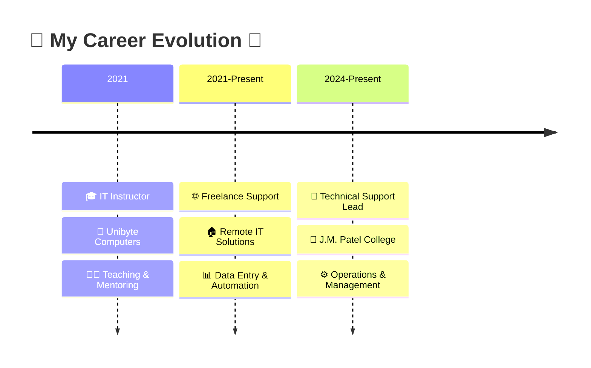

# 🌟 Saurabh Sunil Tiwade

  

---

## 🎯 **About Me**

<table>
<tr>
<td width="50%">

### 🌟 **Who Am I?**

🔹 **📍 Location:** Bhandara, Maharashtra, India  
🔹 **💼 Role:** Central Store & Technical Support Assistant  
🔹 **❤️ Passion:** Transforming complex tech into simple solutions  
🔹 **🎯 Mission:** Bridging the gap between technology and people  
🔹 **🌱 Currently:** Mastering Full-Stack Development  
🔹 **⚡ Fun Fact:** Geography graduate turned tech enthusiast!  

</td>
<td width="50%">

</td>
</tr>
</table>

> ### 🌟 *"From Geography maps to code maps - I navigate complex systems and make them user-friendly!"* 🌟

---

## 🚀 **Professional Journey**

---

## 💻 **Tech Arsenal**

### **🛠️ Core Technologies**

### **📊 Expertise Areas**
<table>
<tr>
<td align="center" width="200">
 
<strong>🔧 Technical Support</strong> 
<em>Hardware & Software</em>
</td>
<td align="center" width="200">
 
<strong>🎓 Teaching & Training</strong> 
<em>Curriculum Development</em>
</td>
<td align="center" width="200">
 
<strong>💻 Web Development</strong> 
<em>Responsive Design</em>
</td>
<td align="center" width="200">
 
<strong>⚡ Digital Solutions</strong> 
<em>Process Automation</em>
</td>
</tr>
</table>

---

## 🏆 **Certifications & Achievements**

  

---

## 🌟 **What Makes Me Unique**

| 🎯 **Problem Solving** | 🎓 **Teaching Excellence** | 🚀 **Continuous Learning** | 🤝 **Team Collaboration** |
|:---:|:---:|:---:|:---:|
| **🔧 Complex troubleshooting** | **📚 Curriculum design** | **📈 Always upskilling** | **🌐 Cross-team support** |
| 💻 Hardware/Software fixes | 🎪 Workshop facilitation | 🎯 CS50 journey | 👨‍🎓 Student mentoring |
| 💡 Creative solutions | 🧭 Student guidance | 🏆 FreeCodeCamp graduate | 💼 Freelance projects |

---

## 🎨 **Fun Facts About Me**

<table>
<tr>
<td align="center" width="25%">
 
<strong>🗺️ Geography → Tech</strong> 
<em>From reading maps to reading code!</em>
</td>
<td align="center" width="25%">
 
<strong>📚 Learning Enthusiast</strong> 
<em>Harvard CS50 is my current adventure</em>
</td>
<td align="center" width="25%">
 
<strong>🧩 Problem Solver</strong> 
<em>Every bug is just a puzzle waiting to be solved</em>
</td>
<td align="center" width="25%">
 
<strong>☕ Coffee Powered</strong> 
<em>Code + Coffee = Magic</em>
</td>
</tr>
</table>

---

## 📫 **Let's Connect & Collaborate**

---

### 💡 *"Technology is best when it brings people together and solves real problems!"*

**🤝 Open for Collaboration** • **💼 Available for Projects** • **📚 Always Learning**

