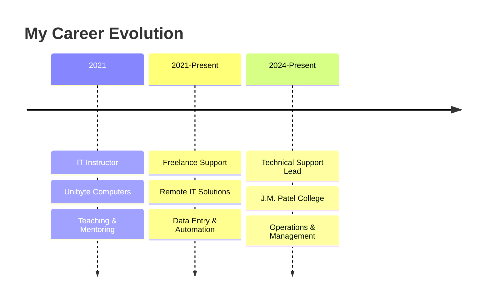

# 🌟 Saurabh Sunil Tiwade

  

---

## 🎯 **About Me**

🔹 **Location:** 📍 Bhandara, Maharashtra, India  
🔹 **Role:** Central Store & Technical Support Assistant  
🔹 **Passion:** Transforming complex tech into simple solutions  
🔹 **Mission:** Bridging the gap between technology and people  

  

> ### *"From Geography maps to code maps - I navigate complex systems and make them user-friendly!"*

 

---

## 🚀 **Professional Journey**

---

## 💻 **Tech Arsenal**

### **🛠️ Core Technologies**

### **📊 Expertise Areas**
<table>
<tr>
<td align="center" width="200">
 
<strong>Technical Support</strong> 
<em>Hardware & Software</em>
</td>
<td align="center" width="200">
 
<strong>Teaching & Training</strong> 
<em>Curriculum Development</em>
</td>
<td align="center" width="200">
 
<strong>Web Development</strong> 
<em>Responsive Design</em>
</td>
<td align="center" width="200">
 
<strong>Digital Solutions</strong> 
<em>Process Automation</em>
</td>
</tr>
</table>

---

## 🏆 **Certifications & Achievements**

<a href="https://saurabh-tiwade.github.io/Portpholio-website-SR/">Portfolio</a>

</a>

---

## 🌟 **What Makes Me Unique**

| 🎯 **Problem Solving** | 🎓 **Teaching Excellence** | 🚀 **Continuous Learning** | 🤝 **Team Collaboration** |
|:---:|:---:|:---:|:---:|
| **Complex troubleshooting** | **Curriculum design** | **Always upskilling** | **Cross-team support** |
| Hardware/Software fixes | Workshop facilitation | CS50 journey | Student mentoring |
| Creative solutions | Student guidance | FreeCodeCamp graduate | Freelance projects |

---

## 🎨 **Fun Facts About Me**

 **Geography → Tech:** *From reading maps to reading code!*  
 **Learning Enthusiast:** *Harvard CS50 is my current adventure*  
 **Problem Solver:** *Every bug is just a puzzle waiting to be solved*  
 **Coffee Powered:** *Code + Coffee = Magic*  

---

## 📫 **Let's Connect & Collaborate**

<a href="https://saurabh-tiwade.github.io/Portpholio-website-SR/">Portfolio</a>

</a>

---

### 💡 *"Technology is best when it brings people together and solves real problems!"*

**🤝 Open for Collaboration** • **💼 Available for Projects** • **📚 Always Learning**

